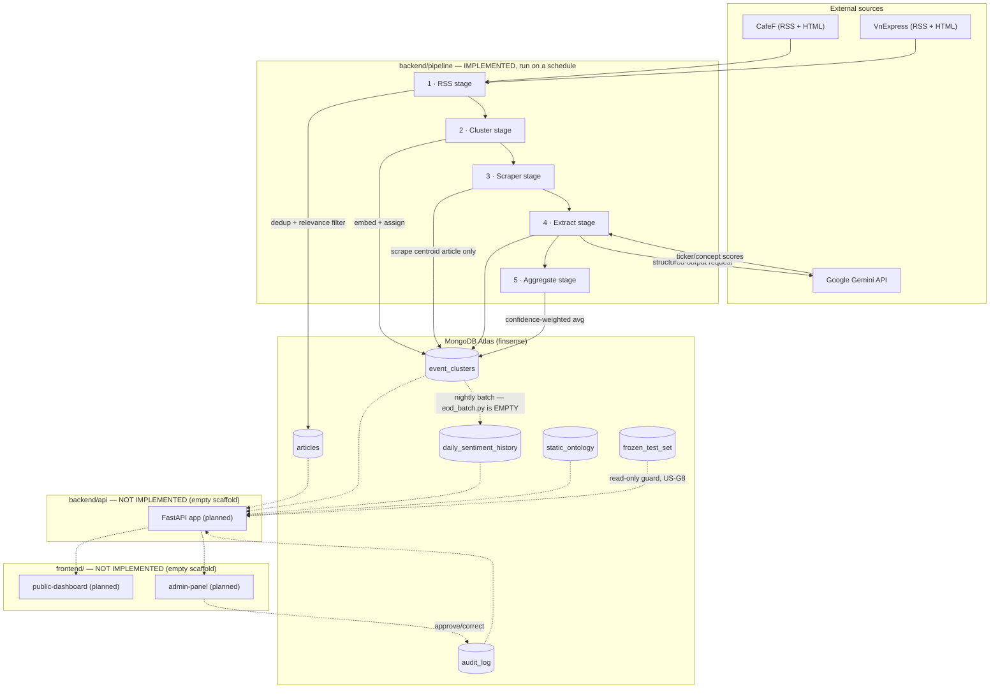

# PROJECT_CONTEXT.md

> Canonical knowledge base for AI assistants working on this repository. Written for machine
> consumption, not for onboarding humans (see `docs/ONBOARDING.md` for that, though it is
> currently empty). Facts here are derived from reading the repository on **2026-08-04**;
> re-verify anything load-bearing against the current code before acting on it, especially in
> a project this early-stage and this actively refactored.

---

## Project Overview

| | |
|---|---|
| **Name** | FIN-SENSE / FinSense |
| **Organization** | RMIT Vietnam Fintech Club (`github.com/rmitvietnamfintechclub/FinSense`) |
| **Type** | Student/club engineering project, sprint- and ticket-driven (branches named `FS-<n>-...`) |

**Purpose.** FinSense measures the *tone of Vietnamese financial news coverage* toward VN30
stock tickers and a fixed set of macro/sector concepts. It is explicitly **not** a price
prediction or buy/sell/hold signal — the OpenAPI spec states this in its top-level description,
and `docs/mongodb_schema.md` repeats it in the `event_clusters` schema comments.

**Core problem being solved.** Vietnamese retail investors have no single place to see how
financial media is currently portraying a given stock or sector. News is scattered across
outlets, duplicated, and unstructured. FinSense ingests RSS feeds from Vietnamese financial
news sources, groups articles that describe the same real-world event, extracts a sentiment
score per ticker/concept mentioned using an LLM, and aggregates that into a confidence-weighted
score — with a human-in-the-loop audit workflow to correct AI mistakes.

**High-level functionality (intended, end to end):**
1. Discover new articles from RSS feeds (CafeF, VnExpress).
2. Cluster articles into "events" by embedding similarity.
3. Scrape the full body of one representative article per source per event.
4. Ask Gemini to extract per-ticker/per-concept sentiment from that body.
5. Aggregate per-source AI responses into one confidence-weighted score per event.
6. (Planned) Roll daily aggregates into a per-ticker EOD history for charting.
7. (Planned) Serve everything through a FastAPI backend to a public dashboard and an
   authenticated admin audit panel.

**Current development status — read this before trusting any "it exists" assumption.**
This repository is in an early, actively-developed state with a **large gap between what is
scaffolded (folders + empty files) and what is implemented (files with actual code)**. Verified
by byte count, not by filename:

| Area | Status |
|---|---|
| `backend/core` | ✅ Implemented (config, schemas, DB clients, scoring math, text/log utils) |
| `backend/pipeline` | ✅ Implemented and unit-tested (all 5 stages have working code) |
| `backend/pipeline/stages/aggregate/eod_batch.py` | ❌ Empty — EOD batch job not implemented |
| `backend/api` (entire tree, incl. all tests) | ❌ 100% empty stub files, 0 bytes each |
| `frontend/` (both apps + `ui` + `types`) | ❌ 100% empty stub files, 0 bytes each, including `package.json` |
| `evaluation/` | ⚠️ Mostly empty; only `cluster_threshold.py` is implemented |
| `scripts/` | ⚠️ `init_db.py` and `reset_dev_db.py` work; the other 3 scripts are empty |
| `docs/adr/*.md` (4 files) | ❌ Empty — titles exist, rationale does not |
| `docs/ARCHITECTURE.md`, `docs/ONBOARDING.md`, `README.md` | ❌ Empty or near-empty |
| `.github/workflows/*.yml` (7 files) | ⚠️ Only `ci.yml` has content (one ruff-lint job) |
| Package manager | ⚠️ Mid-migration from Poetry to `uv`, **uncommitted** in the working tree |

In short: **this is a working data-ingestion-and-AI-extraction pipeline with no serving layer
and no frontend yet.** Treat `docs/openapi.yaml` and `docs/mongodb_schema.md` as design
contracts for work that hasn't been built, not as descriptions of running code.

---

## Architecture Overview

FinSense is a monorepo with a batch pipeline (implemented), a planned REST API, and two
planned Next.js frontends, all sharing one MongoDB Atlas cluster.



**Major components and responsibilities:**

| Component | Responsibility | Status |
|---|---|---|
| `backend/core` | Shared config, MongoDB clients (sync + async), Pydantic schemas, scoring math, enums | Implemented |
| `backend/pipeline` | Scheduled batch job: RSS → cluster → scrape → extract → aggregate | Implemented |
| `backend/api` | Read-only serving API for dashboards + write API for audit actions | Not implemented |
| `frontend/public-dashboard` | Public, unauthenticated sentiment dashboard | Not implemented |
| `frontend/admin-panel` | Authenticated admin panel to audit/correct AI extractions | Not implemented |
| `frontend/ui`, `frontend/types` | Shared React components / OpenAPI-generated TS types | Not implemented |
| `evaluation/` | Benchmarks pipeline output against a hand-labeled frozen test set | Mostly not implemented |
| MongoDB Atlas | Single shared datastore for pipeline output, audit trail, and (eventually) serving reads | Live, schema documented |

**Data flow (implemented half):** RSS feeds → `articles` collection (dedup key: normalized
URL) → embedding + incremental cosine clustering → `event_clusters` (one document per
real-world event, `source_breakdown` per news source) → scrape only the **centroid/representative
article** per source (not every article) → Gemini structured extraction → per-source
`ai_response` written back onto the cluster → confidence-weighted aggregation across sources
written to `aggregated_analysis` on the same cluster document. Stages never pass data to each
other in memory across process boundaries in production — they hand off through MongoDB, which
is what makes a run idempotent/resumable (explicit design note in
`docs/FOLDER_STRUCTURE_GUIDANCE.md`).

**Request flow:** Not applicable yet — no API exists. `docs/openapi.yaml` is the intended
contract (see [API Overview](#api-overview)).

---

## Repository Structure

Two nested directories exist on disk: an outer `FinSense/` (not a git repo, just a container)
and the actual project + git repo at `FinSense/FinSense/`. All paths below are relative to that
inner directory (the actual repo root).

| Directory | Purpose |
|---|---|
| `backend/` | Python backend: shared `core`, batch `pipeline`, and (unimplemented) serving `api` |
| `frontend/` | Two Next.js apps (`public-dashboard`, `admin-panel`) + shared `ui` and `types` packages — all currently empty scaffolding |
| `evaluation/` | Frozen hand-labeled benchmark + evaluation harness for the extraction pipeline |
| `docs/` | Architecture notes, DB schema reference, ADRs, onboarding, OpenAPI contract |
| `scripts/` | One-off ops scripts (DB init, dev DB reset, admin seeding, lexicon validation, evaluation runner) |
| `.github/` | CI workflows, CODEOWNERS (empty), dependabot config (empty), PR template |
| root files | `pyproject.toml`/`uv.lock` (Python deps), `test.py` (ad hoc manual smoke script), `.env.example` |

Key top-level files:

- `pyproject.toml` — single Python project definition for the whole `backend/` package (uv +
  hatchling). Currently mid-migration from Poetry (see [Known Limitations](#known-limitations)).
- `test.py` — a manual, assertion-free smoke-test script at the repo root (`from backend.pipeline...
  import fetch_all_feeds`, prints results). Not part of the pytest suite.
- `.env.example` — documents `MONGODB_URI`, `MONGODB_DB_NAME`, `LLM_API_KEY` only; several other
  settings used by `backend/core/config.py` have code defaults and are not listed there (see
  [Environment Variables](#environment-variables)).

### Repository tree (curated — omits `__pycache__`, `.pytest_cache`, `.venv`, `node_modules`)

```
FinSense/                              (outer container, not a git repo)
└── FinSense/                          (actual repo root)
    ├── .github/
    │   ├── workflows/                 7 files: only ci.yml has content
    │   ├── CODEOWNERS                 empty
    │   ├── dependabot.yml             empty
    │   └── pull_request_template.md
    ├── backend/
    │   ├── core/                      shared layer — IMPLEMENTED
    │   │   ├── config.py
    │   │   ├── database.py            sync (pymongo) client
    │   │   ├── database_async.py      async (motor) client
    │   │   ├── enums.py                Ticker (VN30, 30) / Concept (10)
    │   │   ├── exception.py           EMPTY
    │   │   ├── formulas.py          
    │   │   ├── log.py
    │   │   ├── text_utils.py
    │   │   └── schemas/               article.py, event_cluster.py, sentiment.py
    │   ├── api/                       serving API — 100% EMPTY SCAFFOLD
    │   │   ├── main.py
    │   │   ├── features/{auth,audit,dashboard,events,history,ticker,internal}/
    │   │   ├── external/price/
    │   │   └── tests/{unit,integration,e2e}/
    │   └── pipeline/                  scheduled pipeline — IMPLEMENTED
    │       ├── main.py                run_pipeline() orchestrator
    │       ├── stages/
    │       │   ├── rss/               fetch → normalize → dedup/filter → save
    │       │   ├── cluster/           embed → cosine-cluster → upsert EventCluster
    │       │   ├── scraper/           fetch representative article body (CafeF, VnExpress)
    │       │   ├── extract/           Gemini structured-output sentiment extraction
    │       │   └── aggregate/         confidence-weighted score per ticker/concept
    │       │       └── eod_batch.py   EMPTY — nightly EOD job not implemented
    │       ├── lexicon/               5 JSON files; only relevance_keywords.json is used in code
    │       └── tests/{unit,integration,live}/
    ├── frontend/                      100% EMPTY SCAFFOLD (every file is 0 bytes)
    │   ├── public-dashboard/
    │   ├── admin-panel/
    │   ├── ui/
    │   └── types/
    ├── evaluation/
    │   ├── cluster_threshold.py       IMPLEMENTED — clustering threshold benchmark
    │   ├── runner.py                  EMPTY
    │   ├── metrics.py                 EMPTY
    │   ├── frozen_test_set/           no data, README.md empty
    │   └── results/                   3 evolution_*.json files, all EMPTY
    ├── docs/
    │   ├── ARCHITECTURE.md            EMPTY
    │   ├── ONBOARDING.md              EMPTY
    │   ├── FOLDER_STRUCTURE_GUIDANCE.md   the most complete doc in the repo
    │   ├── mongodb_schema.md          full schema reference
    │   ├── CLUSTERING_THRESHOLD.md    threshold calibration writeup
    │   ├── openapi.yaml               REST API contract (design-only — not implemented)
    │   └── adr/                       4 files, ALL EMPTY (ADR-001..004)
    ├── scripts/
    │   ├── init_db.py                 IMPLEMENTED
    │   ├── reset_dev_db.py            IMPLEMENTED
    │   ├── seed_admins.py             EMPTY
    │   ├── validate_lexicon.py        EMPTY
    │   └── run_evaluation.py          EMPTY
    ├── .env.example
    ├── pyproject.toml
    ├── uv.lock                        untracked in git status at time of writing
    ├── README.md                      near-empty ("# FinSense#")
    └── test.py                        manual smoke script, not a pytest test
```

---

## Backend

### Overall backend architecture

Two Python subsystems share one `backend/core` layer and one MongoDB database, but are
intentionally decoupled at the process level:

- **`backend/pipeline`** — a batch job, invoked by a scheduler (GitHub Actions cron, per
  `docs/FOLDER_STRUCTURE_GUIDANCE.md`, though the actual cron workflow files are currently
  empty). Writes to MongoDB. **Never calls the API.**
- **`backend/api`** — a FastAPI app (planned). Reads from MongoDB, does audit writes. **No AI
  calls, no pipeline imports.** Not implemented yet.

This split exists so the pipeline (slow, does LLM/network calls, runs on a schedule) and the API
(fast, request/response, always-on) can scale, deploy, and fail independently.

### Folder responsibilities

`backend/core/` is imported by both subsystems and must stay generic:

| File | Responsibility |
|---|---|
| `config.py` | `pydantic-settings` classes reading from `.env`: `DatabaseSettings`, `PipelineSettings`, `APISettings` (currently empty — no API-specific settings defined yet) |
| `database.py` | Sync MongoDB client (`pymongo`), single cached client via `@lru_cache`, TLS via `certifi` — used by the pipeline |
| `database_async.py` | Async MongoDB client (`motor`), module-level singleton with explicit `init_db()`/`get_db()`/`close_db()` lifecycle — intended for the API's startup/shutdown hooks |
| `enums.py` | `Ticker` (30 VN30 symbols, frozen as of 2026-07-27) and `Concept` (10 sector/macro categories) — both `StrEnum`, deliberately frozen for the project's lifetime (see [Design Decisions](#design-decisions)) |
| `exception.py` | **Empty.** No shared exception hierarchy exists yet |
| `formulas.py` | `confidence_weighted_avg()` — the one piece of shared scoring math, pure function, no I/O |
| `log.py` | `setup_logging()` — stdlib `logging.basicConfig` to stdout, INFO level |
| `text_utils.py` | `strip_html()` — BeautifulSoup-based HTML→text helper |
| `schemas/` | Pydantic v2 models: `article.py` (pipeline-internal contract), `event_cluster.py` (persisted `event_clusters` document shape), `sentiment.py` (`TickerSentiment`, `ConceptSentiment`, `AIResponse`, `AggregatedAnalysis` and their "aggregated" variants) |

**Schema rule (from `docs/FOLDER_STRUCTURE_GUIDANCE.md`, followed in code):** define each model
once; `event_cluster.py` imports from `sentiment.py` rather than redeclaring anything. If the
same class name shows up in two files, something is wrong.

### Pipeline overview

Entry point: `backend/pipeline/main.py: run_pipeline()`. Fixed stage order, each stage timed and
logged by a shared `_stage()` helper:

```
RSS → CLUSTER → SCRAPE → EXTRACT → AGGREGATE
```

If the RSS stage finds no new articles, the run stops immediately (`if not new_articles: return
[]`) — no wasted embedding/LLM calls. Each stage takes the previous stage's output and a MongoDB
collection handle; all persistence happens through explicit `Collection`/`UpdateOne` calls, not
implicitly.

### Stage-by-stage explanation

**1 · RSS (`stages/rss/`)** — discovers candidate articles.
- `rss_fetcher.py`: fetches each configured `(source, feed_url)` pair via `feedparser` +
  `requests`. Per-feed failures are caught and logged; one bad feed never aborts the run.
- `url_normalizer.py`: canonicalizes URLs before dedup — forces `https`, lowercases host, strips
  trailing slash, drops known tracking params (`utm_*`, `fbclid`, `gclid`, `ref`, `spref`,
  `zarsrc`), sorts remaining query params, drops the fragment. Raises `ValueError` on a blank URL
  (caller must skip it rather than silently produce a garbage key).
- `filter.py`: two independent filters — **F2 dedup** (`is_duplicate`, checks the normalized URL
  against the unique-indexed `articles.url` field) and **F3 relevance** (`is_relevant`, drops
  noise like birthdays/festivals/promos using `lexicon/relevance_keywords.json`).
- `stage.py` (`run_rss`): fetches all feeds, dedups within the batch and against MongoDB, filters
  irrelevant articles, saves the survivors, returns them.

**2 · Cluster (`stages/cluster/`)** — embeds and clusters articles into events.
- `embedder.py`: `sentence-transformers` model `intfloat/multilingual-e5-base` (configurable),
  loaded once per process via `@lru_cache`. Prefixes text with `"query: "` (E5 convention).
- `clustering.py`: pure NumPy incremental cosine-similarity clustering
  (`cluster_articles()`). Each article joins the closest existing cluster if cosine similarity ≥
  `CLUSTER_SIMILARITY_THRESHOLD` (default **0.91**, calibrated — see
  `docs/CLUSTERING_THRESHOLD.md`), otherwise it seeds a new singleton cluster that later articles
  in the same batch can join. Extensive input validation (shape, dtype, zero-vectors, NaN/Inf,
  dimension consistency). Never mutates caller-owned inputs.
- `centroid.py`: `calculate_centroid()` (mean of a batch) and `update_centroid()` — an
  incremental-mean identity (`old + (new − old) / (n+1)`) so historical embeddings never need to
  be retained, only the running centroid + count. Proven algebraically in
  `docs/CLUSTERING_THRESHOLD.md`.
- `stage.py` (`run_cluster`): embeds the batch, loads existing clusters from a rolling lookback
  window (`CLUSTER_LOOKBACK_DAYS`, default 3 — bounds the comparison set so history doesn't grow
  unbounded), assigns articles, **read-modify-write upserts** each touched `EventCluster` document
  (merging with any prior state — representative article, coverage, audited AI responses are
  preserved across runs), and backfills `cluster_id` onto the `articles` collection.

**3 · Scraper (`stages/scraper/`)** — fetches full body text, but **only** for each cluster's
representative article per source (clustering runs before scraping specifically to avoid
scraping bodies that will never reach the LLM).
- `source_client.py`: dispatches by lowercased source name to a per-source adapter, then strips
  HTML to plain text.
- `adapters/cafef.py`, `adapters/vnexpress.py`: `requests` + `BeautifulSoup`, CSS-selector-based
  content-div extraction, junk-node removal (ads, related-article boxes, scripts). Returns `None`
  on timeout/HTTP error/missing selector rather than raising.
- `stage.py` (`run_scraper`): iterates every cluster's `source_breakdown`, fetches each
  representative article's body, sets `content_fed_to_ai`, and bulk-writes via `UpdateOne` with
  `array_filters` (targets the matching `source_breakdown` array element without a full document
  rewrite).

**4 · Extract (`stages/extract/`)** — LLM sentiment extraction per source.
```
prompt_builder.build_prompt()  → (prompt, prompt_version)
client.invoke_llm()            → (raw dict, model_version)
extractor.extract_from_text()  → ExtractionResult(ai_response | failure_type)
stage.run_extract()            → reads clusters, writes ai_response to MongoDB
```
- `client.py`: wraps `langchain_google_genai.ChatGoogleGenerativeAI` with
  `.with_structured_output(EXTRACTION_SCHEMA)`. The JSON schema is built dynamically from the
  `Ticker`/`Concept` enums (`enum: [...]` constraints), so the model is structurally constrained
  to the known vocabulary. Knows *only* about the LLM provider — no prompt building, no
  persistence.
- `prompt_builder.py`: loads a versioned template from `stages/extract/prompts/{version}.txt`
  (cached), substitutes `{article_text}`. Active version comes from `PROMPT_VERSION` (default
  `v1`).
- `extractor.py`: composes the two, owns failure handling. Catches a specific set of exceptions
  (Gemini quota/timeout/unavailable/API errors, LangChain parse errors, missing prompt file,
  missing config) and maps each to a `failure_type` string — never lets one exception type crash
  the run uncategorized. Validates each `ticker_sentiments`/`concept_sentiments` entry
  individually via Pydantic; **a single out-of-vocabulary or malformed entry is dropped and
  logged, never fails the whole article.**
- `stage.py` (`run_extract`): skips sources already audited or already extracted (idempotent
  re-runs). On `llm_quota_exhausted`, **stops the entire extraction loop immediately** — remaining
  sources are picked up on the next scheduled run rather than failing loudly.
- `prompts/`: `v1.txt` has content and is the active default; `v2.txt` and `v3.txt` exist but are
  **empty** (reserved for future prompt evolutions — matches `evaluation/results/evolution_2_*`
  / `evolution_3_*` naming, which are also currently empty). **Convention: never edit an existing
  version file — add a new one.** `model_version`/`prompt_version` are stamped on every
  `AIResponse` specifically so evolutions stay comparable.

**5 · Aggregate (`stages/aggregate/`)** — folds per-source AI responses into one event-level score.
- `event_aggregator.py`: `build_aggregated_analysis()` collects every `(score, confidence)` pair
  per ticker/concept across a cluster's `source_breakdown`, then calls
  `core.formulas.confidence_weighted_avg()` with `AI_CONFIDENCE_THRESHOLD` (default 0.4) as the
  inclusion floor. Sources below the confidence threshold are excluded from both numerator and
  denominator. If **no** source clears the threshold, the result is `None` (a "no confident read"
  — semantically distinct from a neutral `0.0` score; also drives the `needs_review` flag
  described in `docs/mongodb_schema.md`).
- `stage.py` (`run_aggregate`): writes `aggregated_analysis` back onto each `event_clusters`
  document.
- `eod_batch.py`: **empty.** The nightly job that should roll `event_clusters` into
  `daily_sentiment_history` (per `docs/mongodb_schema.md`) does not exist yet.

**Lexicon files (`backend/pipeline/lexicon/*.json`):** only `relevance_keywords.json` is
actually read by any code (`stages/rss/filter.py`). `vietnam_financial_lexicon.json`,
`concept_dictionary.json`, `satatic_ontology.json` (filename has a typo — "satatic" not
"static"), and `ticker_dictionary.json` are present but **not imported anywhere in
`backend/`**. Their intended consumer (a future ontology-weighted score, an alias-matching admin
UI feature, or a leftover from a pre-LLM approach) is not evidenced in code — `TODO/Unknown`.

### API layer

Not implemented. See [API Overview](#api-overview) for the documented contract
(`docs/openapi.yaml`) and the planned `features/<domain>/{router,schemas,service}.py` convention.

### Core utilities

Covered above under **Folder responsibilities** (`backend/core/*`). Notable: `formulas.py` is
deliberately kept pure (no DB, no config reads) specifically so pipeline aggregation and a future
API-side recomputation can share identical, independently unit-testable math.

### Services

No dedicated "services" layer exists outside the planned `features/<domain>/service.py` pattern
documented for the (unimplemented) API. The pipeline's stage coordinators (`run_rss`,
`run_cluster`, `run_scraper`, `run_extract`, `run_aggregate`) play the equivalent role for the
batch side.

### Configuration

`pydantic-settings` `BaseSettings` subclasses in `backend/core/config.py`, each reading `.env`
with `extra="ignore"`:

- `DatabaseSettings` → `database_settings` singleton
- `PipelineSettings` → `pipeline_settings` singleton (embedding, clustering, aggregation, RSS,
  HTTP, and LLM knobs — see [Environment Variables](#environment-variables))
- `APISettings` → `api_settings` singleton, currently **empty** (`class APISettings(BaseSettings):
  pass`)

### Dependency management

`uv` (root `pyproject.toml` + `uv.lock`), Python `>=3.13`, `hatchling` build backend, single
package `finsense` wrapping `backend/`. **Mid-migration from Poetry** — see
[Known Limitations](#known-limitations).

### Logging

One shared setup: `backend/core/log.py: setup_logging()` calls `logging.basicConfig` to stdout at
`INFO`, format `"%(asctime)s - %(name)s - %(levelname)s - %(message)s"`. Every module gets its
own logger via `logging.getLogger(__name__)`. No structured/JSON logging, no external log
aggregation (no Sentry/OTel) observed anywhere in the repo.

### Error handling

No shared exception hierarchy (`core/exception.py` is empty). The pattern used throughout the
pipeline instead:
- Catch specific, expected exception types close to the boundary that raises them (HTTP errors,
  feed parse errors, Gemini/LangChain errors, Pydantic `ValidationError`).
- Log with context (`logger.warning`/`logger.exception`/`logger.error`, occasionally with
  `extra={...}`).
- **Isolate failure to the smallest unit possible** — one bad RSS feed, one bad article, one bad
  extraction entry, or (at worst) one bad source-within-a-cluster — never the whole run. The
  `extractor.py` `failure_type` string taxonomy (`llm_quota_exhausted`, `llm_timeout`,
  `malformed_response`, `invalid_confidence`, etc.) is the closest thing to a formal error model
  in the codebase.

---

## Frontend

**Status: 100% unimplemented.** Every file under `frontend/` — including `package.json`,
`tsconfig.json`, `next.config.ts`, `tailwind.config.ts`, all `.tsx`/`.ts` component and hook
files, and `frontend/types/generate.sh` — is a **zero-byte placeholder**. The directory structure
below is the *intended* layout as documented in `docs/FOLDER_STRUCTURE_GUIDANCE.md`; none of it is
buildable or runnable today. Framework version, styling approach beyond a `tailwind.config.ts`
filename, and state-management library are all `Unknown` — no code exists to confirm them.

### Intended folder structure

```
frontend/
  public-dashboard/            Public-facing sentiment dashboard (no auth)
    src/app/                   Next.js pages: /, /dashboard, /dashboard/events, /ticker/[symbol]
    src/features/
      dashboard/                Market gauge, ticker list, event list
      ticker/                   Ticker detail page, dual-axis (price + sentiment) chart
      search/                   Ticker search
    src/lib/                   API client, formatters, query keys
  admin-panel/                 Authenticated admin audit panel
    src/app/                   /login, /audit
    src/features/
      audit/                   Audit table, correction form, error-type picker, unmapped concepts panel
      auth/                    Login form, auth hook
    src/lib/                   API client, query keys
  ui/                          Shared React components used by both apps
    src/  SentimentGauge.tsx, SentimentBadge.tsx, Sidebar.tsx, Breadcrumb.tsx, Disclaimer.tsx
  types/                       TypeScript types generated from docs/openapi.yaml
    generated/api.types.ts     Intended to be auto-generated — never hand-edit
    enums.ts                   Frontend-side enum mirrors
    generate.sh                Intended regeneration entry point
```

**State management, routing, API communication:** `Unknown` — no implementation exists. The
naming (`src/lib/query-keys.ts` in both apps) suggests an intended TanStack Query (React Query)
based data-fetching layer, but this is inferred from a filename, not confirmed by code — mark as
`TODO` to verify once implementation starts.

**Important components (planned, per filenames only):** `SentimentGauge`, `MarketGauge`,
`TickerGauge` (score visualization), `DualAxisChart` (price vs. sentiment over time),
`AuditTable`/`CorrectForm`/`ErrorTypePicker` (admin correction workflow), `UnmappedConceptsPanel`
(admin-side handling of concepts the AI mentioned that don't map cleanly to the taxonomy).

---

## Database

**Technology:** MongoDB Atlas, Free Tier (M0), database name `finsense` (or `FinSense` per the
Pydantic default — confirm the actual configured value against `.env`, not this doc).

**Access pattern:** `pymongo` (sync) from the pipeline via `backend/core/database.py`; `motor`
(async) from the (unimplemented) API via `backend/core/database_async.py`. Both connect to the
same cluster.

### Schema overview

Per `docs/mongodb_schema.md`, the design calls for 7 collections; `scripts/init_db.py` (the
actual, runnable init script) creates only 6 — it does **not** create a `concept_dictionary`
collection that the doc's section 5 describes. This is a documented/actual drift — `TODO`:
reconcile before relying on either as ground truth.

| Collection | Writer | Reader | Purpose | Created by `init_db.py`? |
|---|---|---|---|---|
| `articles` | Pipeline (RSS stage) | Pipeline (dedup) | URL-deduped article metadata; full content is never persisted here (kept in-memory only) | ✅ |
| `event_clusters` | Pipeline (cluster/scrape/extract/aggregate stages) | Serving API (planned), audit panel (planned) | One document per real-world event; core collection | ✅ |
| `daily_sentiment_history` | Nightly batch job (**not implemented** — `eod_batch.py` is empty) | Serving API (planned) | Pre-computed EOD scores + closing price for history charts | ✅ |
| `static_ontology` | Manual seed / admin | Serving API (planned) | Concept → sector weight map | ✅ |
| `concept_dictionary` | Manual seed (documented only) | — | Concept alias resolution | ❌ not created by init script |
| `audit_log` | Serving API audit endpoints (planned) | Admin panel (planned) | Immutable log of every approve/correct action | ✅ |
| `frozen_test_set` | Manual seed only | Evaluation scripts | Hand-labeled benchmark; must never be written to by app code (403 guard requirement, currently unenforced since there's no API) | ✅ |

### Important models (persisted document shapes, from `backend/core/schemas/` + `docs/mongodb_schema.md`)

**`event_clusters`** (see `EventCluster` in `backend/core/schemas/event_cluster.py`):
```
cluster_id, event_title, created_at, updated_at, centroid_embedding: float[]
event_coverage: { total_articles, all_urls: { source -> [urls] } }
aggregated_analysis: {
  ticker_sentiments:  [{ ticker, score | null }]   # null = no source cleared AI_CONFIDENCE_THRESHOLD
  concept_sentiments: [{ concept, score | null }]
  needs_review: bool   # documented in mongodb_schema.md; not yet a field on the Pydantic model — TODO verify
}
source_breakdown: [{
  source,
  representative_article: { url, published_at, content_fed_to_ai, centroid_similarity },
  ai_response: { ticker_sentiments[], concept_sentiments[], ai_confidence, model_version, prompt_version } | null,
  is_audited: bool
}]
```
Note: `docs/mongodb_schema.md` documents a `needs_review` boolean on `aggregated_analysis`; the
current `AggregatedAnalysis` Pydantic model (`backend/core/schemas/sentiment.py`) does **not**
define that field. Doc/code drift — `TODO`.

**`articles`**: `article_id`, `url` (unique), `source`, `published_at`, `ingested_at`,
`cluster_id` (nullable, backfilled after clustering).

### Relationships

Not a relational schema — MongoDB documents, related by string keys:
`articles.cluster_id → event_clusters.cluster_id`; `audit_log.cluster_id → event_clusters.cluster_id`;
`daily_sentiment_history.ticker` and `event_clusters.aggregated_analysis.ticker_sentiments[].ticker`
both reference the `Ticker` enum vocabulary (not a foreign key, just a shared closed vocabulary).

### Migration strategy

None found. No migration framework, no versioned schema migrations. `scripts/init_db.py` is
idempotent for collection/index creation (`CollectionInvalid` is caught and treated as
already-exists) but there is no mechanism for evolving a schema once documents exist. Schema
changes are expected to be reflected in `docs/mongodb_schema.md` first, then `scripts/init_db.py`,
per the explicit workflow table in `docs/FOLDER_STRUCTURE_GUIDANCE.md`.

---

## AI Integration

**Provider:** Google Gemini, via `langchain-google-genai` (`ChatGoogleGenerativeAI`). Default
model `gemini-2.5-flash`, configurable via `LLM_MODEL_NAME`. No other LLM provider is wired in.

**Prompt flow:**
```
build_prompt(article_text) → load prompts/{PROMPT_VERSION}.txt, substitute {article_text}
invoke_llm(prompt) → model.with_structured_output(EXTRACTION_SCHEMA).invoke(prompt)
extract_from_text(article_text) → validate + wrap into AIResponse, dropping bad entries individually
```
`EXTRACTION_SCHEMA` (built in `client.py` from the `Ticker`/`Concept` enums) constrains the model
to emit only known ticker/concept values, a `score` in `[-1.0, 1.0]`, and an overall
`ai_confidence` in `[0.0, 1.0]`.

**Summarization pipeline:** there is no separate summarization step — `event_title` is chosen by
picking the title of whichever article in the cluster is closest to the cluster centroid
(`cluster/stage.py: _pick_event_title`), not by generating new text.

**Embedding / vector search:** embeddings (`intfloat/multilingual-e5-base` via
`sentence-transformers`) are used **only** for in-process cosine-similarity clustering — they are
not stored in a MongoDB vector index and there is no semantic-search feature. `centroid_embedding`
is persisted per cluster purely so clustering can resume incrementally across pipeline runs, not
for querying.

**AI-related utilities:** `stages/extract/client.py` (provider binding + schema),
`stages/extract/prompt_builder.py` (versioned template loading), `stages/extract/extractor.py`
(orchestration + failure taxonomy), `core/formulas.py` (post-hoc confidence weighting, not
itself an AI call).

**Evaluation:** intended to benchmark prompt/model "evolutions" against `frozen_test_set` using a
"bucket agreement" metric (buckets derived at read time from the stored float, never persisted
alongside it, per `docs/FOLDER_STRUCTURE_GUIDANCE.md`). **Not implemented** — `evaluation/runner.py`
and `evaluation/metrics.py` are empty, and `evaluation/frozen_test_set/` has no seed data yet. The
one implemented evaluation artifact is `evaluation/cluster_threshold.py`, which calibrated the
clustering threshold (0.91) using a held-out Vietnamese-headline benchmark with hard negatives —
see `docs/CLUSTERING_THRESHOLD.md` for the full methodology and results table.

---

## External Services

| Service | Role | Status |
|---|---|---|
| **CafeF** (`cafef.vn`) | RSS feed (`/thi-truong-chung-khoan.rss`) + HTML scraping for article bodies | Live, implemented |
| **VnExpress** (`vnexpress.net`) | RSS feed (`/rss/kinh-doanh.rss`) + HTML scraping for article bodies | Live, implemented |
| **Google Gemini** | LLM sentiment extraction | Live, implemented (needs `LLM_API_KEY`) |
| **MongoDB Atlas** | Primary datastore (M0 free tier) | Live |
| **Price API** | Would supply `closing_price` for `daily_sentiment_history` | `backend/api/external/price/` exists as a placeholder module only — not wired to any real provider |
| **Auth provider** | Admin login | No external provider; planned as first-party JWT issuance (`/auth/login` in `docs/openapi.yaml`), not implemented |
| **Render** | Implied prod hosting for the API (`docs/openapi.yaml` lists `https://finsense-api.onrender.com/api` as the production server) | Inferred from docs only, not confirmed by deploy config in-repo |
| **Vercel (?)** | `.gitignore` includes `.vercel/`, weakly suggesting an intended frontend host | `Unknown` — inferred signal only, not confirmed |

No storage service (S3-equivalent) is used or referenced — article bodies are never persisted
long-term, only `content_fed_to_ai` on the representative article per source.

---

## Environment Variables

Source of truth: `backend/core/config.py` (code defaults) and `.env.example` (documents only 3 of
these). All variables are read via `pydantic-settings` from a `.env` file at the repo root.

| Variable | Class | Required? | Default | Purpose |
|---|---|---|---|---|
| `MONGODB_URI` | `DatabaseSettings` | **Required** (raises at DB-client construction if unset) | `""` | MongoDB Atlas connection string |
| `MONGODB_DB_NAME` | `DatabaseSettings` | Optional | `"FinSense"` | Target database name |
| `LLM_API_KEY` | `PipelineSettings` | **Required for extraction** (raises in `client.py` if unset) | `""` | Google Gemini API key |
| `EMBEDDING_MODEL_NAME` | `PipelineSettings` | Optional | `intfloat/multilingual-e5-base` | Sentence-transformers model for clustering |
| `EMBEDDING_BATCH_SIZE` | `PipelineSettings` | Optional | `32` | Batch size for embedding calls |
| `E5_QUERY_PREFIX` | `PipelineSettings` | Optional | `"query: "` | E5 model convention prefix prepended before embedding |
| `CLUSTER_SIMILARITY_THRESHOLD` | `PipelineSettings` | Optional | `0.91` | Cosine similarity floor to join an existing cluster (calibrated, see `docs/CLUSTERING_THRESHOLD.md`) |
| `CLUSTER_LOOKBACK_DAYS` | `PipelineSettings` | Optional | `3` | How far back to load existing clusters for matching |
| `AI_CONFIDENCE_THRESHOLD` | `PipelineSettings` | Optional | `0.4` | Minimum per-source `ai_confidence` to be included in aggregation |
| `RSS_FEEDS` | `PipelineSettings` | Optional | 2 hardcoded `(source, url)` tuples (CafeF, VnExpress) | Feed list to poll — note: overriding a `list[tuple[str,str]]` via a `.env` string requires JSON-encoding it; not documented anywhere, likely impractical in practice |
| `HTTP_TIMEOUT` | `PipelineSettings` | Optional | `10` (seconds) | Timeout for RSS/scraper HTTP requests |
| `HTTP_HEADERS` | `PipelineSettings` | Optional | dict with a hardcoded Chrome `User-Agent` | Headers sent with RSS/scraper requests |
| `LLM_MODEL_NAME` | `PipelineSettings` | Optional | `"gemini-2.5-flash"` | Gemini model identifier |
| `LLM_TIMEOUT` | `PipelineSettings` | Optional | `60` (seconds) | Per-request Gemini timeout |
| `LLM_MAX_RETRIES` | `PipelineSettings` | Optional | `1` | Gemini call retry count |
| `EXTRACTION_TEMPERATURE` | `PipelineSettings` | Optional | `0.0` | Gemini sampling temperature |
| `PROMPT_VERSION` | `PipelineSettings` | Optional | `"v1"` | Active prompt template filename (without `.txt`) |

`APISettings` currently defines **no fields** — API-specific config (e.g. a JWT signing secret)
does not exist yet; `TODO` once `backend/api` is implemented.

Example `.env` (safe placeholders, mirrors `.env.example`):
```
MONGODB_URI=mongodb+srv://<db_username>:<db_password>@<cluster>.mongodb.net/?appName=RMITFintech
MONGODB_DB_NAME=FinSense
LLM_API_KEY=your-gemini-api-key
```

---

## Build & Development Workflow

**Installation:**
```shell
uv sync            # installs from pyproject.toml + uv.lock, Python >=3.13 required
```
Note: the repo is mid-migration from Poetry — `backend/pyproject.toml`, `backend/poetry.lock`,
and root `requirements.txt` are deleted-but-uncommitted in the working tree at time of writing;
`uv.lock` is new/untracked. Verify `git status` before assuming a clean `uv sync` will reproduce
what's actually running anywhere.

**Running the pipeline:**
```shell
python -m backend.pipeline.main
```
Requires `MONGODB_URI` and `LLM_API_KEY` to be set (the extract stage will fail per-item, not
crash, if `LLM_API_KEY` is missing — but nothing useful will be extracted).

**Running the API:** not possible — `backend/api/main.py` is empty.

**Running the frontend:** not possible — no `package.json` has any content, no lockfiles exist.

**Running tests:**
```shell
pytest backend/pipeline/tests/unit -v          # fast, fully mocked, always run
pytest backend/pipeline/tests/live -m live -v -s   # real Gemini calls, needs LLM_API_KEY, opt-in
```
`backend/pipeline/tests/integration/test_full_pipeline.py` exists but is empty.
`backend/api/tests/**` all exist but are empty (no API to test).

⚠️ **Currently broken gating:** `docs/FOLDER_STRUCTURE_GUIDANCE.md` documents a
`[tool.pytest.ini_options]` block in `pyproject.toml` with `addopts = "--import-mode=importlib -m
'not live'"` and a registered `live` marker, meant to exclude live/paid tests by default. The
**current** root `pyproject.toml` (post Poetry→uv migration) has **no such section** — confirmed
via `git diff pyproject.toml`, which shows the old Poetry file (that had this block) was replaced
by the new uv-style file (that doesn't). Running bare `pytest` today will not automatically skip
`live` tests and will warn about an unregistered marker. Treat this as a regression to fix, not
as documented behavior to rely on.

**Linting:**
```shell
ruff check backend/
```
This is the only check `ci.yml` runs. Note: `ci.yml` sets up Python **3.11** for this job while
`pyproject.toml` requires Python **>=3.13** — an inconsistency (harmless for a syntax-only lint
pass, but worth fixing).

**Formatting:** `ruff` is a dev dependency; no explicit `ruff format` invocation or config beyond
defaults was found — `Unknown` exact formatting rules.

**Docker:** not present anywhere in the repo — `Unknown`/not used.

**CI/CD:** `.github/workflows/` has 7 files; only `ci.yml` has content — a single `lint-python`
job (`ruff check backend/`) triggered on PRs to `main`. `ci-api.yml`, `ci-pipeline.yml`,
`ci-frontend.yml`, `codegen-types.yml`, `schedule-pipeline.yml`, `schedule-eod.yml` are all
present as **empty files** — planned, not implemented. There is currently no automated test
execution in CI and no scheduled trigger for the pipeline, despite the pipeline itself being
runnable.

---

## API Overview

**No implementation exists.** Everything below is transcribed from `docs/openapi.yaml`, the
declared contract, for use when `backend/api` is eventually built — treat it as a spec to
implement against, not as a description of live behavior.

**Base path:** `/api`. Servers: `https://finsense-api.onrender.com/api` (prod, per the spec) and
`http://localhost:8000/api` (local dev).

**Auth:** Bearer JWT (`bearerAuth` security scheme). No global security requirement
(`security: []` at the document root) — individual endpoints opt in. `/auth/login` issues the
token; audit endpoints require it.

| Method | Path | Purpose | Auth |
|---|---|---|---|
| GET | `/dashboard/overview` | Metric cards + Fear & Greed-style gauge for a time window (`24h`/`48h`/`72h`) | none |
| GET | `/dashboard/feed` | Top-5-per-page ticker or event feed (`sort=ticker\|event`, paginated) | none |
| GET | `/ticker/{symbol}` | Ticker identity card + live-computed sentiment gauge for a window | none |
| GET | `/ticker/{symbol}/history` | EOD sentiment + closing price history for the dual-axis chart (`days=7\|30\|90`) | none |
| GET | `/ticker/{symbol}/events` | Paginated recent events mentioning a ticker | none |
| POST | `/auth/login` | Admin login → `{ access_token, token_type }` | none (issues auth) |
| GET | `/audit/events` | Paginated audit queue, unaudited-first | JWT |
| PATCH | `/audit/events/{cluster_id}/{source}` | Approve or correct one source's AI extraction within an event | JWT |
| GET | `/audit/log` | Paginated, immutable audit history | JWT |

**Error responses:** standardized `Error { error: string, detail: string }` schema, reused across
`400` (bad request), `401` (missing/invalid JWT), `403` (forbidden — explicitly called out for
"attempt to write to `frozen_test_set`"), `404`, and `500` responses.

**Notable contract details:**
- Sentiment scores are `nullable` floats in `[-1.0, 1.0]`; `null` means "no valid events in the
  window," rendered by the frontend as a neutral grey gauge (`is_empty_state` flag on
  `TickerDetail`).
- Ticker-level live score is computed **at request time** from `event_clusters`, not read from
  `daily_sentiment_history` (that collection only backs the historical chart).
- `PATCH /audit/events/{cluster_id}/{source}` on `action_type=correct` requires an `error_type`
  from a fixed taxonomy: `No error`, `Wrong magnitude`, `Wrong direction`, `Wrong ticker`, `Missed
  ticker` — matching `audit_log.error_type` in the DB schema.

---

## Testing

**Framework:** `pytest` (+ `pytest.mark`), with `mongomock` available as a dev dependency for
DB-backed tests (though the one file that would use it for a full pipeline integration test,
`backend/pipeline/tests/integration/test_full_pipeline.py`, is currently empty).

**Structure:**
```
backend/pipeline/tests/
  unit/          Isolated, fully mocked/pure, fast — the bulk of real coverage today
  integration/   Wired-together components, mongomock, no network — file exists, empty
  live/          Real Gemini calls — gated by `live` marker + LLM_API_KEY presence, opt-in only
backend/api/tests/
  unit/, integration/, e2e/   all present, all empty — no API to test yet
```

Implemented unit test files and rough size (a proxy for coverage depth): `test_aggregate.py`
(402 lines), `test_builder.py` (424 lines), `test_extract.py` (330 lines), `test_ingest.py` (205
lines), `test_cluster.py` (173 lines), `test_scraper.py` (142 lines), `test_embedder.py` (85
lines), `test_clean.py` (35 lines). `test_main.py` exists but is empty.

**How to run:**
```shell
pytest backend/pipeline/tests/unit -v                    # fast suite
pytest backend/pipeline/tests/live -m live -v -s          # opt-in, costs quota, needs LLM_API_KEY
```
See the ⚠️ note under [Build & Development Workflow](#build--development-workflow) — the
marker-based exclusion of `live` tests that should make bare `pytest` safe by default is
currently not configured in `pyproject.toml`.

---

## Coding Standards

Inferred from the implemented code (`backend/core`, `backend/pipeline`), not from a style guide
document (none exists):

| Aspect | Convention observed |
|---|---|
| **Python version / syntax** | 3.13+ features used: PEP 604 unions (`str \| None`), `from __future__ import annotations` in most modules, `StrEnum`, dataclasses with `slots=True` |
| **Data modeling** | Pydantic v2 (`BaseModel`, `Field(ge=..., le=...)`) for every persisted or I/O-boundary shape; plain `@dataclass(slots=True)` for internal-only value objects (`Cluster`, `ClusteringResult`, `Metrics`) |
| **Naming** | `snake_case` modules/functions/variables, `PascalCase` classes, stage coordinator functions named `run_<stage>` (e.g. `run_rss`, `run_cluster`), private helpers prefixed `_` |
| **File organization** | Enforced convention: each pipeline stage folder has helper modules plus one `stage.py` holding the `run_<stage>` coordinator; **the coordinator is the only thing that touches MongoDB**, helpers stay pure and unit-testable in isolation |
| **Dependency injection** | No DI framework — plain "parameter with a `None` default that falls back to `get_database().<collection>`" pattern everywhere (e.g. `def run_rss(db_articles: Collection | None = None)`), which is what lets tests inject `mongomock`/fakes without a framework |
| **Error handling** | Catch narrow, expected exception types close to the source; log with the stdlib `logging` module; isolate failure to the smallest unit (one feed, one article, one extraction entry) rather than aborting a batch; string-based failure-type taxonomy at the extract-stage boundary instead of a custom exception hierarchy |
| **Logging** | `logger = logging.getLogger(__name__)` per module, `%s`-style lazy formatting (not f-strings, mostly — some f-strings do appear, e.g. in `filter.py`, `stage.py` files — not perfectly consistent), occasional structured `extra={...}` |
| **Documentation style** | Module-level docstrings explain the **why**/contract of a stage, not just what it does (e.g. "Clustering runs before scraping on purpose..."); function docstrings only where behavior is non-obvious; inline comments are sparse and reserved for rationale that isn't derivable from the code itself (e.g. the centroid-update algebraic identity) |
| **Type hints** | Comprehensive — including `numpy.typing.NDArray`/`ArrayLike` and `collections.abc.Sequence`/`Mapping` where relevant, not just built-ins |
| **Formatting** | `ruff` is present as a dev dependency and is the only CI check; no explicit format config beyond defaults found — `Unknown` exact rules |

---

## Design Decisions

`docs/adr/ADR-001` through `ADR-004` exist **by filename only** — all four are empty, so their
stated rationale is not actually recorded in the repository. The decisions below are inferred
from code and supporting docs; where an ADR title implies a decision whose reasoning isn't
recoverable from code, it's marked `TODO`.

1. **Score math centralized in `core/formulas.py`** (ADR-001 title: "score math location"). Kept
   pure (no DB/I/O) and shared so the pipeline's aggregation and a future API-side recomputation
   can use identical, independently unit-tested math rather than two implementations drifting
   apart. Rationale beyond this is `TODO` (ADR body empty).
2. **JWT over a session store** (ADR-002 title). No stated rationale in-repo (`TODO`); consistent
   with a stateless API meant to run on Render without a dedicated session backend.
3. **OpenAPI-driven TypeScript codegen over hand-written types** (ADR-003 title). Evidenced by
   `frontend/types/generate.sh` (currently empty) and the instruction in
   `docs/FOLDER_STRUCTURE_GUIDANCE.md` to "never edit `generated/api.types.ts` by hand" — the
   goal is clearly to keep `docs/openapi.yaml` as the single source of truth and prevent
   frontend/backend contract drift. Full rationale `TODO` (ADR body empty).
4. **Apps/workspace structure** (ADR-004 title): two independent Next.js apps (`public-dashboard`,
   `admin-panel`) instead of one app with route-based access control, sharing a `ui` component
   package and a `types` package. Likely reasoning — separating the public, unauthenticated
   surface from the authenticated admin surface at the deployment boundary, not just the code
   boundary — but this is inference, not documented (`TODO`).
5. **Cluster before scrape.** Explicitly justified in `docs/FOLDER_STRUCTURE_GUIDANCE.md`: only
   the centroid/representative article per source needs its full body fetched, so clustering
   first avoids scraping bodies that would never be sent to the LLM.
6. **Incremental centroid math instead of storing every embedding.** Proven algebraically in
   `docs/CLUSTERING_THRESHOLD.md`; keeps `event_clusters` documents small and clustering O(existing
   clusters) rather than O(all historical articles) per run.
7. **`None`/`null` for "no confident read," distinct from a neutral `0.0` score.** Both
   `core/formulas.confidence_weighted_avg` (returns `None` when total weight is 0) and the
   `event_clusters` schema comments make this distinction explicit — it drives a `needs_review`
   surfacing flag for human audit rather than silently reporting false neutrality.
8. **`Ticker`/`Concept` enums are deliberately frozen for the project's lifetime**, not
   auto-synced to the real VN30 index. Historical sentiment records are labeled against this
   exact vocabulary; changing it would make old records incomparable. Extending it requires an
   explicit project decision, not a routine update.
9. **Prompt versioning via append-only files + stamped `model_version`/`prompt_version` on every
   `AIResponse`.** Enables comparing extraction "evolutions" (see `evaluation/results/evolution_*`
   naming) without losing the ability to attribute any given score to the exact prompt/model that
   produced it.

---

## Known Limitations

Concrete, verified issues — not speculation:

- **`backend/api` is entirely unimplemented.** Every file (`main.py`, all `features/*`,
  `external/price/*`, all tests) is 0 bytes. There is no running serving layer; `docs/openapi.yaml`
  is a design contract only.
- **`frontend/` is entirely unimplemented.** Every file across both apps and the shared packages
  is 0 bytes, including `package.json`/`tsconfig.json`/`next.config.ts` — the frontend cannot
  currently be installed or run at all.
- **`stages/aggregate/eod_batch.py` is empty.** The nightly job that should populate
  `daily_sentiment_history` (needed for the ticker history chart) does not exist.
- **`evaluation/` is mostly stubs.** `runner.py`, `metrics.py`, `README.md`, and all three
  `results/evolution_*.json` files are empty; `frozen_test_set/` has no seed data. Only
  `cluster_threshold.py` is functional. The prompt-evolution comparison workflow described in
  `docs/FOLDER_STRUCTURE_GUIDANCE.md` cannot currently be run.
- **3 of 5 `scripts/` are empty** (`run_evaluation.py`, `seed_admins.py`, `validate_lexicon.py`) —
  referenced by name in `docs/FOLDER_STRUCTURE_GUIDANCE.md` as available tools but don't exist.
- **All 4 ADR files are empty.** Decisions are named but not justified in-repo.
- **Only 1 of 7 GitHub Actions workflows has content** (`ci.yml`, a single ruff-lint job). No
  automated test execution in CI; no scheduled trigger exists for the pipeline or the EOD batch
  job despite the pipeline being runnable today.
- **`pytest` live-test gating is currently broken.** The `[tool.pytest.ini_options]` block
  (`addopts = "-m 'not live'"` + registered `live` marker) documented in
  `docs/FOLDER_STRUCTURE_GUIDANCE.md` and present in the old Poetry `pyproject.toml` is **absent**
  from the current uv-migrated `pyproject.toml` (confirmed via `git diff`). Bare `pytest` no
  longer excludes quota-costing live tests by default.
- **Package manager migration (Poetry → uv) is mid-flight and uncommitted.** `git status` shows
  `backend/pyproject.toml`, `backend/poetry.lock`, and root `requirements.txt` deleted but not
  committed, plus an untracked `uv.lock`. The repository is in a transitional state.
- **CI Python version mismatch.** `ci.yml` sets up Python 3.11 for the lint job; `pyproject.toml`
  requires `>=3.13`.
- **`backend/core/exception.py` is empty** — no shared exception hierarchy exists despite the
  pipeline needing one (currently ad hoc per-module).
- **Several lexicon JSON files are dead data.** `vietnam_financial_lexicon.json`,
  `concept_dictionary.json`, `satatic_ontology.json` (typo in filename), and
  `ticker_dictionary.json` are not referenced by any Python code — only `relevance_keywords.json`
  is actually loaded.
- **Doc/schema drift:** `docs/mongodb_schema.md` describes a `concept_dictionary` collection and a
  `needs_review` field on `aggregated_analysis` that don't exist in `scripts/init_db.py` or the
  current Pydantic schema, respectively.
- **No rate limiting, retry/backoff beyond `LLM_MAX_RETRIES=1`, or circuit breaker** for the
  selector-based CafeF/VnExpress scrapers — a markup change on either site silently breaks
  extraction for that source (returns `None`, logged, no alerting).
- **No observability tooling** (no Sentry/OTel/structured logging) beyond stdlib logging to
  stdout.
- **Root-level `test.py`** is an assertion-free manual smoke script, not part of the pytest suite
  — a maintenance/clarity smell, not a functional bug.

---

## Future Improvements

Derived from the gap between the documented design and the current implementation — not
speculative feature invention:

- Implement `backend/api` end-to-end against `docs/openapi.yaml`.
- Implement `frontend/public-dashboard`, `frontend/admin-panel`, `frontend/ui`, `frontend/types`
  (including the OpenAPI→TS codegen script referenced by ADR-003's title).
- Implement `stages/aggregate/eod_batch.py` so `daily_sentiment_history` actually gets populated.
- Wire `schedule-pipeline.yml` / `schedule-eod.yml` so the pipeline and EOD batch run
  automatically instead of manually.
- Build out `evaluation/runner.py` + `evaluation/metrics.py` and seed `frozen_test_set/` so
  prompt/model evolutions can actually be benchmarked, closing the loop the `evaluation/results/`
  naming already anticipates.
- Restore the `pytest` `live`-marker exclusion in the current `pyproject.toml` post-uv-migration.
- Populate `docs/adr/*.md` with real rationale now that the decisions are named.
- Implement `backend/api/external/price/` against a real market-data provider.
- Decide and implement the admin credential/auth flow (`scripts/seed_admins.py` is currently
  empty).
- Either wire up or remove the currently-unused lexicon JSON files
  (`vietnam_financial_lexicon.json`, `concept_dictionary.json`, `satatic_ontology.json`,
  `ticker_dictionary.json`).
- Reconcile `docs/mongodb_schema.md` with `scripts/init_db.py` and the actual Pydantic schema
  (`concept_dictionary` collection, `needs_review` field).

---

## AI Development Notes

**Frequently modified modules (per `git log`).** Recent commit activity concentrates entirely in
`backend/pipeline/stages/*` — e.g. `feat: finish run_pipeline & Handle LLM exhaust`, `feat:
event-level aggregation`, `feature: build basic AI structure for extraction`, `feat:
cosine-similarity clustering + centroid representative selection`. This is where active
development is currently happening; `backend/api` and `frontend/` have had no implementation
commits yet.

**Critical files — change with care:**
- `backend/core/enums.py` — `Ticker`/`Concept` are a frozen vocabulary. Changing values requires
  a project-wide decision and re-running the frozen test set (per the module docstring itself).
- `backend/core/schemas/*` — the contract shared between the pipeline and the future API.
  "Define a model once" is an explicit repo convention; a duplicated class name across files means
  something is wrong.
- `backend/core/formulas.py` — must stay pure (no I/O), since it's the one piece of math meant to
  be identical across the pipeline and any future API-side recomputation.
- `backend/pipeline/stages/extract/prompts/*.txt` — **append-only.** Never edit an existing
  version file; add a new one and bump `PROMPT_VERSION`.
- `docs/openapi.yaml` — the only complete description of intended API behavior; any future
  `backend/api` implementation should conform to it (or update it deliberately, not
  accidentally).
- `docs/mongodb_schema.md` — source of truth for DB shape; update this before touching
  `scripts/init_db.py`.

**Project conventions:**
- Ticket-driven branch names: `FS-<number>-<short-description>`.
- PR template requires confirming `ruff check backend/` passes and that no secrets are
  hardcoded — `.github/CODEOWNERS` exists but is empty (no enforced ownership currently).
- `docs/FOLDER_STRUCTURE_GUIDANCE.md` is the closest thing this repo has to a contributor guide —
  treat its "Quick reference — where does my code go?" table as authoritative for where new code
  belongs.

**Extra caution areas:**
1. `frozen_test_set` must never be written to by application code (a `403` guard is specified in
   the OpenAPI contract, US-G8) — currently moot since no API exists yet, but this constraint
   must be honored the moment one is built.
2. `audit_log` must be immutable — no update/delete code path should ever be added to it.
3. Never edit an existing `prompts/vN.txt` file.
4. Don't change `LLM_MODEL_NAME` mid-evolution without re-running the frozen test set — `
   model_version` comparability breaks otherwise.
5. **Most of this repository is empty scaffolding, not dead code.** Before assuming a feature
   exists because its file path exists, check its size (`wc -l` or similar) — the folder structure
   was deliberately seeded ahead of the implementation, and a large fraction of paths that look
   like working code are 0-byte placeholders (all of `backend/api`, all of `frontend/`, most of
   `evaluation/`, most ADRs, most CI workflows). This document states, per section, which parts are
   real; re-verify before relying on any of it if significant time has passed since 2026-08-04.

---

## Documentation Map

| Document | Status | Purpose |
|---|---|---|
| `README.md` | Near-empty (`# FinSense#`) | Not a functioning project readme |
| `docs/ARCHITECTURE.md` | Empty | Intended: system design, container diagram, data flow — not yet authored |
| `docs/ONBOARDING.md` | Empty | Intended: setup instructions for new members — not yet authored |
| `docs/FOLDER_STRUCTURE_GUIDANCE.md` | **Substantive** | The primary how-to doc: where code belongs, stage conventions, testing tiers, CI layout, and a quick-reference table. Primary source for this document's Backend/Frontend/Repository Structure sections. |
| `docs/mongodb_schema.md` | Substantive (with known drift) | Full collection/field/index reference + an Atlas setup checklist. Source of truth for DB shape, though it has drifted slightly from `scripts/init_db.py` and the Pydantic schema. |
| `docs/CLUSTERING_THRESHOLD.md` | Substantive | Explains and reproduces the 0.91 cosine-clustering threshold calibration; pairs with `evaluation/cluster_threshold.py`. |
| `docs/openapi.yaml` | Substantive | REST API contract — the only complete description of intended API behavior, since no API code exists yet. |
| `docs/adr/ADR-001-score-math-location.md` | Empty | Title only |
| `docs/adr/ADR-002-jwt-vs-session-store.md` | Empty | Title only |
| `docs/adr/ADR-003-type-codegen-vs-manual.md` | Empty | Title only |
| `docs/adr/ADR-004-apps-workspace-structure.md` | Empty | Title only |
| `evaluation/README.md` | Empty | — |
| `evaluation/frozen_test_set/README.md` | Empty | — |
| `frontend/types/README.md` | Empty | — |
| `.github/pull_request_template.md` | Substantive | PR checklist: acceptance criteria, no hardcoded secrets, `ruff check` passes |
