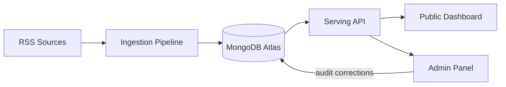

# FinSense

Sentiment intelligence for the Vietnamese stock market, built from real-time financial news.

FinSense ingests Vietnamese financial news (CafeF, VnExpress), clusters articles that describe
the same market event, and uses an LLM to extract sentiment toward VN30 tickers and sector
concepts. Scores are confidence-weighted and designed to be human-audited, giving a transparent
read on media tone — not a trading signal.

## Key Features

- **Multi-source RSS ingestion** with URL normalization and deduplication.
- **Event clustering** — groups articles describing the same event via sentence embeddings and
  incremental cosine-similarity clustering.
- **Centroid and Scraping** choosing representative articles and scrape for full body content
- **LLM-based sentiment extraction** — Google Gemini extracts per-ticker and per-concept
  sentiment from article text, constrained to a fixed VN30/sector vocabulary.
- **Confidence-weighted aggregation** — combines multiple sources per event into a single score,
  excluding low-confidence extractions.
- **End-of-day history** — a separate nightly batch rolls each ICT day's event sentiment into a
  per-ticker daily score and joins the VNDirect closing price, backing the historical chart.
- **Rubric-driven prompting** — the sentiment and confidence scales are maintained as documents
  and composed into the prompt at render time, along with a Vietnamese financial lexicon that
  tells the model how VN market idiom and jargon actually read. The latest version adds few-shot
  examples drawn from real scraped articles, each citing the cluster it came from.
- **Prompt and model versioning** — every AI response is stamped with the prompt and model
  version that produced it, so extraction quality can be tracked over time.
- **Human-in-the-loop audit** — admins approve or correct AI scores per source article; every
  action is written to an immutable `audit_log`, and a correction rebuilds the event's blended
  score so it reaches the public dashboard immediately.
- **JWT-authenticated admin panel** — bcrypt-hashed credentials, bearer tokens, and admin
  identity carried into every audit record.

## Tech Stack

**Frontend** (planned)
- Next.js, TypeScript
- Two apps: a public dashboard and an authenticated admin panel, sharing a component library and
  API types generated from the OpenAPI spec

**Backend**
- Python 3.13, FastAPI (serving API — 14 endpoints, at full parity with the OpenAPI spec)
- Pydantic v2 for data contracts
- `uv` for dependency management

**Database**
- MongoDB Atlas
- Sync access via PyMongo (pipeline), async access via Motor (API)

**AI/ML**
- Google Gemini (`langchain-google-genai`) for sentiment extraction
- `sentence-transformers` (`intfloat/multilingual-e5-base`) for article embeddings

**DevOps / Infrastructure**
- GitHub Actions — CI (ruff; a test job is still to be added), an hourly pipeline cron and a
  nightly EOD batch cron. Neither schedule is live until it reaches the default branch.
- Render (planned API hosting)
- MongoDB Atlas (M0 free tier)

## Repository Structure

```
FinSense/
├── backend/
│   ├── core/          Shared config, database clients, schemas, scoring logic
│   ├── pipeline/       RSS → cluster → scrape → extract → aggregate, plus the nightly EOD batch
│   └── api/            Serving API (FastAPI) — auth, audit, dashboard, ticker
├── frontend/
│   ├── public-dashboard/   Public sentiment dashboard
│   ├── admin-panel/        Authenticated audit panel
│   ├── ui/                 Shared React components
│   └── types/               API types generated from OpenAPI
├── evaluation/          Clustering-threshold calibration; extraction benchmarking (harness WIP)
├── docs/                Pipeline reference, DB schema, ADRs, OpenAPI spec
├── scripts/             Operational scripts (DB init, seeding, evaluation)
└── .github/workflows/    CI pipelines
```

## System Architecture

FinSense is a monorepo composed of a scheduled data pipeline, a REST API, and two web frontends,
all backed by a shared MongoDB database.



The pipeline fetches news, clusters it into events, and enriches each event with AI-extracted
sentiment. A separate nightly batch then rolls the day's events into per-ticker daily scores. The
API reads from MongoDB to serve dashboards and handles admin corrections. Pipeline and API are
decoupled — the pipeline never calls the API, and the API never calls the LLM.

Both run on a cron — hourly for the pipeline, 00:30 ICT nightly for the EOD rollup. Neither is
live yet: scheduled workflows only fire from the default branch, and the repository has no Actions
secrets, so runs are manual for now. See [`STATE.md`](STATE.md).

For a stage-by-stage breakdown of the pipeline — algorithms, failure handling, and the design
decisions behind them — see [`backend/PIPELINE.md`](backend/PIPELINE.md). For the database shape, see
[`docs/mongodb_schema.md`](docs/mongodb_schema.md). The REST contract — every endpoint, its
parameters and response shape — is [`docs/openapi.yaml`](docs/openapi.yaml), which is the
source of truth the frontend types are generated from. A broader
[`docs/ARCHITECTURE.md`](docs/ARCHITECTURE.md) is still TODO.

Current implementation status, known-broken things, and measured performance are tracked in
[`STATE.md`](STATE.md) — read it before assuming a component works, since much of this repo is
scaffolding seeded ahead of implementation.

## Quick Start

Clone the repository:

```bash
git clone https://github.com/rmitvietnamfintechclub/FinSense.git
cd FinSense
```

Each part of the stack is set up and run independently. Follow the setup instructions in:

- [`backend/README.md`](backend/README.md) — Python environment, database setup, running the
  pipeline and API
- [`frontend/README.md`](frontend/README.md) — Node environment, running the web apps

> **TODO:** `frontend/README.md` does not exist yet — the frontend is unimplemented. Create it
> with component-specific setup steps once that work starts.

### Running the Pipeline Locally

The fastest way to verify a local setup end-to-end is to run the ingestion pipeline directly,
without the API or frontend:

1. Create and activate a virtual environment at the project root (Python 3.13+ required):

   ```bash
   uv venv
   source .venv/bin/activate      # macOS/Linux
   .venv\Scripts\activate       # Windows
   ```

2. Install dependencies into the active environment:

   ```bash
   uv sync --active
   ```

3. Populate `.env` at the project root (see `.env.example`) — at minimum `MONGODB_URI` and
   `LLM_API_KEY` are required. Point `MONGODB_DB_NAME` at a database whose name contains `dev`.

4. Create the collections and their indexes. Run once per database — the pipeline's upserts rely
   on the unique indexes to stay idempotent, and skipping this doesn't fail loudly, it just lets
   duplicates accumulate:

   ```bash
   python3 scripts/init_db.py
   ```

5. *Optional, and only to start over.* Reset the dev database. Destructive, so it refuses unless
   `MONGODB_DB_NAME` contains `dev` or `test`, and it asks for confirmation:

   ```bash
   python3 scripts/reset_dev_db.py
   ```

6. Run the pipeline:

   ```bash
   python3 -m backend.pipeline.main
   ```

   This executes all five stages (RSS → cluster → scrape → extract → aggregate) once and logs a
   per-cluster summary to stdout. A run over a full feed snapshot takes well under a minute, but
   the extract stage makes one Gemini call per cluster per source — around 80 calls on a cold
   start — which will exhaust a free-tier key. It stops cleanly when the quota runs out.

7. Optionally roll the day up into `daily_sentiment_history`:

   ```bash
   python3 -m backend.pipeline.eod_batch.eod_batch            # yesterday, ICT
   python3 -m backend.pipeline.eod_batch.eod_batch 2026-08-23  # a specific past day
   ```

   This is a separate entrypoint, not part of `run_pipeline`. It writes one row per VN30 ticker
   for the target day — a null score where the day had no confident events — and joins the
   VNDirect closing price. Events are keyed to the ICT day they were **created**, so re-running a
   past day reproduces the score that day first produced.

For the full test suite, API setup, environment reference and troubleshooting, see
[`backend/README.md`](backend/README.md).

## Environment Variables

A single `.env` file at the project root configures the whole backend — both the pipeline and the
API. See `.env.example` for the required keys, and
[`backend/README.md`](backend/README.md#environment-variables) for what each one does and which
are worth tuning. At minimum you need `MONGODB_URI`, `LLM_API_KEY` (pipeline) and `JWT_SECRET_KEY`
(the API refuses to start without it).

The frontend does not yet have its own environment configuration — TODO once implementation
starts.

Never commit `.env` files.

## API Documentation

The API contract is defined in [`docs/openapi.yaml`](docs/openapi.yaml) — 14 endpoints, at full
parity with the implementation, and the source the frontend's TypeScript types are generated from.
Adding a route means editing the spec in the same change.

Start the service with `uv run uvicorn backend.api.main:app --reload` and interactive docs are at
`localhost:8000/docs` (Swagger) and `/redoc`. `GET /api/health` is the liveness check and touches
no database.

## Development Workflow

- Work is tracked via ticketed branches (`FS-<number>-short-description`).
- Pull requests target `main` and must pass CI (`ruff check`) before merging. The test suite is
  green but is **not** yet run by CI — run `uv run --extra dev python -m pytest -q` locally.
- See [`.github/pull_request_template.md`](.github/pull_request_template.md) for the PR checklist.
- Architectural decisions are recorded under [`docs/adr/`](docs/adr).

## Contributors

Built by the [RMIT Vietnam Fintech Club](https://github.com/rmitvietnamfintechclub).

TODO — add a contributors list or link to the GitHub contributors graph.

## License

TODO — no license has been specified for this project yet.
