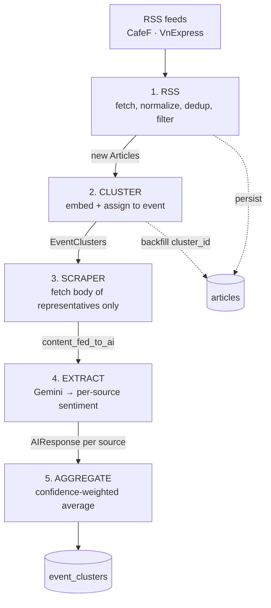

# The FinSense pipeline

How raw Vietnamese financial news becomes a per-event sentiment score, stage by stage.

`run_pipeline()` in `backend/pipeline/main.py` runs five stages in order:

```
rss  →  cluster  →  scraper  →  extract  →  aggregate
```

Every stage hands off through MongoDB rather than in memory. That is what makes a run resumable:
each stage's output is durable before the next one starts. Stages also return their working set in
memory so the next stage can use it directly without re-reading — the Mongo write is for durability,
the return value is for speed.

Since 2026-08-29 the run is resumable *in practice*, not just in principle. Before scraping,
`load_unfinished_clusters` pulls back any cluster from the last `CLUSTER_LOOKBACK_DAYS` that still
has a source with no `ai_response`, or that has extractions but was never aggregated. Those join
this run's fresh clusters, and `run_pipeline` stops only when there is neither new work nor
unfinished work — not, as it used to, whenever RSS found no new articles.

**The backlog goes first.** `work = resumed + clusters`, because extract stops the whole run on the
first quota 429; with fresh clusters at the front, a rate-limited key would spend every run on new
articles and let the backlog age out of the lookback window unfinished.

Resumed clusters deliberately **do not** pass through `run_cluster`. That stage is the only writer
of `updated_at`, which means "when an article last joined this event" and drives the dashboard's
recency decay — finishing an extraction must not move it.



### Why clustering runs before scraping

This is the single most important design decision in the pipeline. Scraping and LLM extraction are
the expensive steps; clustering is nearly free. By clustering on the RSS title + summary *first*,
only one article per source per event ever gets its full body fetched and sent to Gemini. Ten
articles about the same gold-price move cost one extraction, not ten.

The cost of that ordering: `content_fed_to_ai` is `None` between stages 2 and 3, and clustering
quality depends entirely on headline + summary text, which is much thinner than the article body.

---

## The two contracts

Everything flows through two Pydantic models.

**`Article`** (`core/schemas/article.py`) — a candidate from a feed:

```python
title, summary, url, source, published_at, full_content: str | None
```

**`EventCluster`** (`core/schemas/event_cluster.py`) — one real-world event, the pipeline's
central document:

```python
cluster_id            # "evt_" + 12 hex chars
event_title           # headline of the article closest to the centroid
centroid_embedding    # 768 floats, the running mean of member embeddings
event_coverage        # total_articles + {source: [urls]} — every member article
source_breakdown[]    # ONE entry per source, each with:
    representative_article   # url, published_at, content_fed_to_ai, centroid_similarity
    ai_response              # the LLM extraction, None until stage 4
    is_audited               # human review flag, set by the API not the pipeline
aggregated_analysis   # per-ticker / per-concept scores, filled by stage 5
```

Note the shape: `source_breakdown` holds one representative *per source*, not per article. A cluster
with 12 CafeF articles and 3 VnExpress articles has exactly 2 source_breakdown entries and costs 2
LLM calls.

---

## Stage 1 — RSS (`stages/rss/`)

**Entry point:** `run_rss(db_articles) -> list[Article]`
**Returns:** only articles that are *new* this run.

### 1. Fetch

`rss_fetcher.fetch_all_feeds()` walks the `(source, url)` pairs in `pipeline_settings.RSS_FEEDS`:

```python
("CafeF",     "https://cafef.vn/thi-truong-chung-khoan.rss")
("VnExpress", "https://vnexpress.net/rss/kinh-doanh.rss")
```

Resilience is a hard requirement here: a single unreachable or malformed feed must never abort the
run. feedparser signals malformed feeds through a `bozo` flag rather than raising, so every per-feed
failure is caught, logged, and skipped while the remaining feeds still contribute.

`_entry_to_article` drops any entry with no link, and any entry with no parseable date — an article
with no timestamp can't be recency-weighted downstream, so it's useless rather than merely
incomplete. Summaries are run through `strip_html` because both feeds ship HTML in the summary field.

### 2. Normalize the URL

`url_normalizer.normalize_url` canonicalizes before dedup, because the same article arriving with a
UTM tag or a trailing slash must not read as two articles:

- scheme forced to `https`, host lowercased
- trailing slash stripped from the path
- tracking params dropped (`utm_*`, `fbclid`, `gclid`, `ref`, `spref`, `zarsrc`); **all other params
  are kept and sorted**, so `?id=123` still distinguishes genuinely different articles
- fragment dropped

It raises `ValueError` on a blank URL rather than returning something like `https:///`, which would
become a garbage dedup key.

### 3. Filter

Two independent filters, in order:

- **Dedup (`is_duplicate`)** — queries the `articles` collection for the normalized URL. The
  collection is unique-indexed on `url`, so no separate content hash is needed.
- **Relevance (`is_relevant`)** — drops obvious non-financial noise by substring match against
  `lexicon/relevance_keywords.json` (`sinh nhật`, `lễ hội`, `khai trương`, `từ thiện`, `giải thưởng`,
  `kỷ niệm`, `khuyến mãi`). Text is NFC-normalized and lowercased first, since Vietnamese diacritics
  have multiple valid Unicode encodings and a naive comparison would miss matches.

Within-batch duplicate URLs are also skipped via a `seen_url` set — the same story can appear twice
in one feed pull.

### 4. Persist

Survivors are written with `insert_many` and returned. **The write happens before any downstream
stage runs.** That ordering is why a crashed run cannot be repaired by re-reading the feed — the
URLs are already ingested and will dedup away — and therefore why `load_unfinished_clusters` exists
rather than the orchestrator simply retrying RSS.

---

## Stage 2 — Cluster (`stages/cluster/`)

**Entry point:** `run_cluster(articles, event_clusters, articles_collection) -> list[EventCluster]`

This is the most involved stage. It embeds, assigns, persists, and backfills in one pass.

### 1. Embed

`embedder.embed_articles` encodes `"query: " + title + " " + summary` with
`intfloat/multilingual-e5-base` (768 dims, multilingual, handles Vietnamese).

The `"query: "` prefix is not decoration — e5 models are trained with `query:` / `passage:` prefixes
and behave differently without one. The model is loaded once per process via `@lru_cache(maxsize=1)`,
so the ~10s load cost is paid once, not per batch.

### 2. Load candidate clusters

`load_existing_clusters` fetches `event_clusters` documents with
`updated_at >= now - CLUSTER_LOOKBACK_DAYS` (default 3 days), projecting only `cluster_id`,
`centroid_embedding` and `event_coverage.total_articles`. The lookback exists so a growing history
doesn't have to be scanned and compared on every run — an event from last month will not absorb
today's news.

### 3. Assign

`clustering.cluster_articles` is greedy incremental clustering:

```
for each article embedding, in input order:
    scores = cosine similarity to every current centroid
    best = argmax(scores)
    if scores[best] >= CLUSTER_SIMILARITY_THRESHOLD (0.91):
        join that cluster; update its centroid and count IMMEDIATELY
    else:
        start a new singleton cluster, appended to the list
```

Two consequences of updating the centroid immediately:

- A later article in the same batch can join a cluster created earlier in that same batch.
- Clusters **chain**. If A~B and B~C both clear the threshold, C lands in A's cluster even if A and C
  are not similar to each other, because B pulled the centroid partway. This is the main source of
  false merges in production.

**The centroid update is exact, not an approximation.** `centroid.update_centroid` computes:

```
μₙ₊₁ = μₙ + (x - μₙ) / (n + 1) = (x₁ + ... + xₙ + x) / (n + 1)
```

which is why only the stored centroid and article count need to be persisted — the historical
embeddings are never retained. The unit suite checks this against `numpy.mean` over the full input.

`cluster_articles` is defensive by design: it validates dimensions, rejects zero vectors and
non-finite values, and never mutates caller-owned cluster objects. It accepts raw Mongo mappings
directly, so `load_existing_clusters` output needs no conversion.

**Cluster IDs are `evt_` + 12 random hex, not a counter.** The uniqueness check inside
`cluster_articles` only sees clusters inside the lookback window, so a counter-style id could collide
with an older aged-out cluster and silently merge into an unrelated document through
`upsert_event_cluster`'s unscoped find-by-`cluster_id`. IDs must be globally unique on their own.

### 4. Build and persist

For each cluster that received at least one new article, `upsert_event_cluster` does a
read-modify-write: fetch the existing document, merge, save.

- **`select_source_representatives`** picks, per source, the article closest to the cluster's
  centroid. A newly assigned article's similarity is compared against the *stored*
  `centroid_similarity` of the current representative, and the closer one wins. This is why
  `centroid_similarity` is persisted at all — raw embeddings aren't retained, so a later run has no
  other way to compare a new candidate against the incumbent.
- **`merge_event_coverage`** folds new members into `{source: [urls]}` and recomputes
  `total_articles`.
- **`_pick_event_title`** uses the title of the article closest to the centroid — but only for a new
  cluster. An existing cluster keeps its original title.
- Existing `ai_response` and `is_audited` values are carried forward, so re-clustering never destroys
  a completed extraction or a human audit.

Finally `backfill_article_cluster_ids` writes `cluster_id` back onto each article document, matched
by URL.

---

## Stage 3 — Scraper (`stages/scraper/`)

**Entry point:** `run_scraper(clusters, collection) -> list[EventCluster]`

Walks every `source_breakdown` entry and fetches the body of that entry's representative article
only.

**Entries that already have a body are skipped.** A cluster carried over from an earlier run keeps
its `content_fed_to_ai`, and re-fetching it would spend a request on a body already held — which is
how a re-run earns an HTTP 429 from the news site. This mirrors the guard extract has always had.

**Fetches are paced.** `run_scraper` waits `SCRAPER_DELAY_SECONDS` plus a random
`0..SCRAPER_JITTER_SECONDS` between requests (1.0s + 0..0.5s by default) — never before the first
fetch, and never for a source it skips, since a skipped source makes no network call. 78 back-to-back
requests earned 3 HTTP 429s from VnExpress on one run and 13 on the next, and the resume path now
re-attempts a failed fetch every run, so an unpaced hourly cron would hammer a source that is
already refusing it. Jitter matters as much as the delay: a fixed interval from a cron firing on the
hour hits the same source at identical offsets every time. Costs a 78-fetch run roughly 80-120s;
set both to `0` to disable.

`source_client.fetch_body(source, url)` dispatches on the **lowercased** source name, so `"CafeF"`,
`"cafef"` and `" VnExpress "` all resolve. An unknown source logs a warning and returns `None`
instead of raising.

Each adapter (`adapters/cafef.py`, `adapters/vnexpress.py`) is the same shape:

| | CafeF | VnExpress |
|---|---|---|
| Body selector | `div.detail-content` | `article.fck_detail` |
| Junk stripped | `.ads, .box-related, .banner-ads, script, style` | `.ads, .box-tag-list, .banner-ads, script, style` |

Both pass `resp.content` (raw bytes) to BeautifulSoup rather than `resp.text`, so BeautifulSoup reads
the page's declared charset instead of letting requests guess it wrong — guessing wrong mangles
Vietnamese diacritics. Adapters return an HTML fragment; `source_client` runs it through
`strip_html` to get plain text.

**Failure is per-article and never fatal.** Timeouts and request errors are caught, logged, and
return `None`; the entry's `content_fed_to_ai` is simply left unset and the next source is tried.
Successful fetches are written back in one `bulk_write` using positional array filters:

```python
{"$set": {"source_breakdown.$[entry].representative_article.content_fed_to_ai": full_content}}
array_filters=[{"entry.source": sb.source}]
```

**Adding a source:** write an adapter exposing `SOURCE_NAME` and `fetch_body(url)`, register it in
`_ADAPTERS`. Nothing else in the pipeline changes.

---

## Stage 4 — Extract (`stages/extract/`)

**Entry point:** `run_extract(clusters, collection) -> list[EventCluster]`

The only stage that calls the LLM, and the only one that costs money.

### What gets skipped

Each `source_breakdown` entry is skipped when it is already audited, already has an `ai_response`, or
has no scraped body. That first pair of checks is what makes the stage resumable — a re-run does not
re-extract work already done.

### Building the prompt

`prompt_builder.build_prompt` loads `prompts/{PROMPT_VERSION}.txt` (cached) and fills its
placeholders. It returns the version string alongside the prompt so it can be stamped on the result.

`v1` is a self-contained template with a single `{article_text}` placeholder. **`v2` is composed at
render time** from four sources:

| Placeholder | Filled from |
|---|---|
| `{lexicon}` | `pipeline/lexicon/vietnam_financial_lexicon.json`, rendered to markdown bullets |
| `{sentiment_rubric}` | `prompts/docs/SENTIMENT_<version>.md` |
| `{confidence_rubric}` | `prompts/docs/AI_CONFIDENCE_<version>.md` |
| `{article_text}` | the scraped body |

Each loader is cached for the process lifetime, like the template itself.

The lexicon renderer iterates whatever top-level sections and per-entry fields the JSON contains
rather than naming them, so adding a term — or a field, or a whole section — reaches the prompt with
no code change. The two rubric docs are stripped on load: HTML comments always, and the trailing
`## Examples` section while its slots still read `example pending real data`. Fill those slots and
the section starts rendering on its own.

**Substitution order matters.** The three reference sections go in first and `{article_text}` last.
A scraped body is untrusted input; injecting it last means an article containing the literal string
`{sentiment_rubric}` stays literal instead of pulling a rubric into the article slot.

**Prompt files are append-only.** Never edit an existing `vN.txt`; add `v(N+1).txt` and repoint
`PROMPT_VERSION`. Every `AIResponse` carries `prompt_version` and `model_version` so evolutions stay
comparable after the fact. Since `v2`, that rule extends to the composed inputs: editing a rubric doc
or the lexicon changes what an already-stamped `prompt_version` sends, so cut a new version file
whenever you change one.

**Cost note.** `v2`'s fixed preamble is roughly 10k tokens, against roughly 200 for `v1`, and it is
sent on every article. `client.py` does not request explicit prompt caching, though the prefix is
byte-identical across calls within a run.

### Calling Gemini

`client.invoke_llm` uses `ChatGoogleGenerativeAI` with `.with_structured_output(EXTRACTION_SCHEMA)`.
The schema constrains `ticker` and `concept` to **enum lists generated from `core/enums.py`**, so the
model is structurally prevented from inventing a ticker, and scores are bounded to `[-1, 1]` with
confidence in `[0, 1]`.

### The failure taxonomy

`extractor.extract_from_text` maps every anticipated failure to a named `failure_type` rather than
letting it propagate:

| Exception | `failure_type` | Effect |
|---|---|---|
| `ChatGoogleGenerativeAIError` wrapping a 429 | `llm_quota_exhausted` | **Stops the whole extract stage** |
| `ChatGoogleGenerativeAIError`, other 4xx | `llm_api_error` | Skip this source |
| `ResourceExhausted` (429) | `llm_quota_exhausted` | **Stops the whole extract stage** |
| `DeadlineExceeded`, `ServiceUnavailable` | `llm_unavailable` | Skip this source |
| `httpx.TimeoutException` | `llm_timeout` | Skip this source |
| `APIError` | `llm_api_error` | Skip this source |
| `OutputParserException` | `malformed_response` | Skip this source |
| `FileNotFoundError` | `missing_prompt_template` | Skip this source |
| `RuntimeError` | `missing_config` | Skip this source |
| anything else | `unexpected_error[TypeName]` | Skip this source |

Quota exhaustion is the one failure that breaks out of the loop entirely — once the key is dead,
every remaining call would fail too, so continuing just burns time.

**Why two arms handle 429.** `langchain-google-genai` routes every 4xx `ClientError` through
`chat_models._handle_client_error`, which re-raises it as `ChatGoogleGenerativeAIError` — so
`google.api_core`'s `ResourceExhausted` never actually arrives for a quota error, and the real status
has to be recovered from `exc.__cause__`. 5xx responses are `ServerError`, not `ClientError`, so they
skip that wrapper and still arrive as `google.genai.errors.APIError`. The `ResourceExhausted` arm is
kept for the direct-SDK path.

### Partial-validity handling

`_keep_valid` validates entries **one at a time**. A single out-of-vocabulary ticker is logged and
dropped; it does not cost the whole article its extraction. Dropped counts are reported on the
result. This is the "log and drop, never fatal" rule for out-of-vocabulary LLM output.

`ExtractionResult` deliberately distinguishes two things that look alike: a *failure* (`ai_response`
is `None` — retry it) from a *success that found nothing* (`AIResponse` with empty lists — mark it
done). Collapsing those would make the pipeline re-extract articles forever.

---

## Stage 5 — Aggregate (`stages/aggregate/`)

**Entry point:** `run_aggregate(clusters, collection, threshold=None) -> list[EventCluster]`

Collapses N per-source extractions of one event into a single score per ticker and per concept.

`_collect_mentions` walks every source's `ai_response` and groups scores by ticker (and separately by
concept), carrying each source's `ai_confidence` alongside its score. Then
`formulas.confidence_weighted_avg` combines them:

```python
score = Σ(scoreᵢ × confidenceᵢ) / Σ(confidenceᵢ)     for all i where confidenceᵢ >= threshold
```

`threshold` defaults to `AI_CONFIDENCE_THRESHOLD` (0.5). Two properties matter:

- Sources below the confidence threshold are **excluded entirely**, not down-weighted to near-zero.
- If *every* source for a ticker is below threshold, the function returns `None`, and the stored
  `score` is `null` — which is why `AggregatedTickerSentiment.score` is `float | None`. A null score
  means "we have mentions but no trustworthy ones", which is different from a score of 0.0 meaning
  "genuinely neutral".

The result is written to `aggregated_analysis` on the cluster document.

**Clusters with no extraction at all are skipped.** If every source still has `ai_response is None`,
aggregation would write an empty analysis over the empty default already stored — a round trip that
changes nothing. On a quota-stopped run that is the majority of clusters. A *partly* extracted
cluster is still written: one source pending must not suppress another's scores. Skipped clusters
are still returned, so `run_pipeline`'s summary counts stay accurate.

### What aggregate does *not* do

It does **not** compute `S_final`. Recency decay, the time-weighted average across events, and the
ticker/concept blend (`blend_s_final`, `W_TICKER`) all live in `core/formulas.py` and run **at
request time** in the API (`api/features/ticker/aggregator.py`). The pipeline stops at per-event
scores.

Buckets (`strongly_negative` … `strongly_positive`, `core/buckets.py`) are likewise **derived at read
time** from the stored float and never persisted next to it.

---

## Cross-cutting patterns

**The coordinator owns MongoDB.** Each stage folder holds pure helper modules plus a `stage.py`
containing `run_<stage>`. Only the coordinator touches the database; helpers stay pure and
unit-testable. Collections are injected as a parameter defaulting to `None` and falling back to
`get_database().<collection>`. That's the entire DI mechanism — there is no framework, and the tests
rely on it to pass mongomock collections in.

**Idempotency.** Re-running is safe: URL dedup stops re-ingestion, `upsert_event_cluster` merges
rather than overwrites, and extract skips entries that already have an `ai_response`.

**Failures degrade, they don't crash.** A dead feed, an unscrapeable page, a malformed LLM response —
each one costs its own item and nothing more.

---

## Measured performance

One full pass over a live 109-article feed snapshot (2026-08-23), on a developer laptop against
MongoDB Atlas:

| Stage | Time | Notes |
|---|---|---|
| RSS | 1.5s | 110 fetched → 109 kept |
| Cluster | 22.5s | ~10.7s of it embedding at 98 ms/article; assignment itself is 0.01s |
| Scraper | 9.8s | ~0.08s/article, bodies 2.0–5.4 KB |
| Extract | ~9.5s/call | dominates everything else when quota allows |
| Aggregate | 3.7s | pure arithmetic plus one write per extracted cluster |

**Round trips dominate, not computation.** An earlier version of this pipeline took 571s for the
same work, because RSS issued one `find_one` per article for the dedup check and the cluster stage
issued a `find_one` + `update_one` per cluster plus an `update_one` per article. At ~200-270 ms per
Atlas round trip that was ~375 sequential trips. Batching the reads (`$in`) and grouping the
backfill brought it to ~159 and the wall clock to 38s. When tuning a stage, count round trips
before optimising anything else.

**Cost model:** one LLM call per cluster per source. That 109-article snapshot produced 78 clusters
(68 singletons, 10 multi-article) and would attempt **81 calls** — enough to exhaust a free-tier
Gemini key in a single run.

---

## Known gaps

- **A failed fetch is indistinguishable from one not yet attempted.** `fetch_body` returns `None`
  on failure and the stage logs it and moves on; nothing marks the source as failed, so
  `content_fed_to_ai` simply stays unset. The resume path therefore treats a permanently
  unreachable URL as unfinished work and re-attempts it on every run until the cluster ages out of
  `CLUSTER_LOOKBACK_DAYS` — up to ~72 times on an hourly cron. Pacing bounds the *rate* of those
  attempts, not the total. Stopping them needs a per-source attempt counter, which means a new field
  on `source_breakdown` and so a schema change.
- **No backoff on a 429 specifically.** Pacing is a constant delay regardless of how the source is
  responding; a run that starts getting rate-limited does not slow down further.
- **The clustering threshold sits on a cliff.** Real-data pairwise similarity is very tightly
  distributed (p50 0.81, p99 0.90, max 0.96), so 0.91 sits above the 99th percentile. Dropping to
  0.88 collapses 109 articles into 36 clusters with a 56-article blob; 0.86 gives 4 clusters. Do not
  lower it casually.
- **The threshold was calibrated on the wrong text.** `CLUSTERING_THRESHOLD.md` tuned 0.91 against
  *headlines only*, but production embeds title + summary, which shifts similarities up ~0.01 and
  makes ~40% more pairs merge-eligible. The sweep should be re-run on title+summary text.
- **`EXTRACTION_TEMPERATURE` is ignored** by `gemini-3.6-flash`, which uses fixed sampling defaults.
  Extractions are not deterministic, which weakens prompt-evolution comparisons.
- **Topic chaining over-merges.** Distinct same-topic events (domestic gold price vs world gold price
  vs an analyst forecast) merge transitively into one cluster.

---

## Related

- `pipeline/eod_batch/` is a **separate cron entrypoint**, not part of `run_pipeline`. It rolls each
  day's event sentiment into `daily_sentiment_history` and joins the VNDirect closing price. Day
  boundaries are ICT (UTC+7) — see `utc_to_ict_date`, and an event is keyed to its `created_at`, not
  its `updated_at`, so that a re-run of a past day reproduces the score that day first produced.
- `docs/CLUSTERING_THRESHOLD.md` — how 0.91 was derived, and the centroid proof.
- `docs/mongodb_schema.md` — full collection and index reference.
- `docs/RUBRICS/` — the sentiment and confidence scoring rubrics the prompt encodes.
